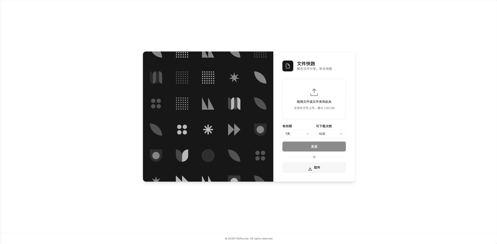
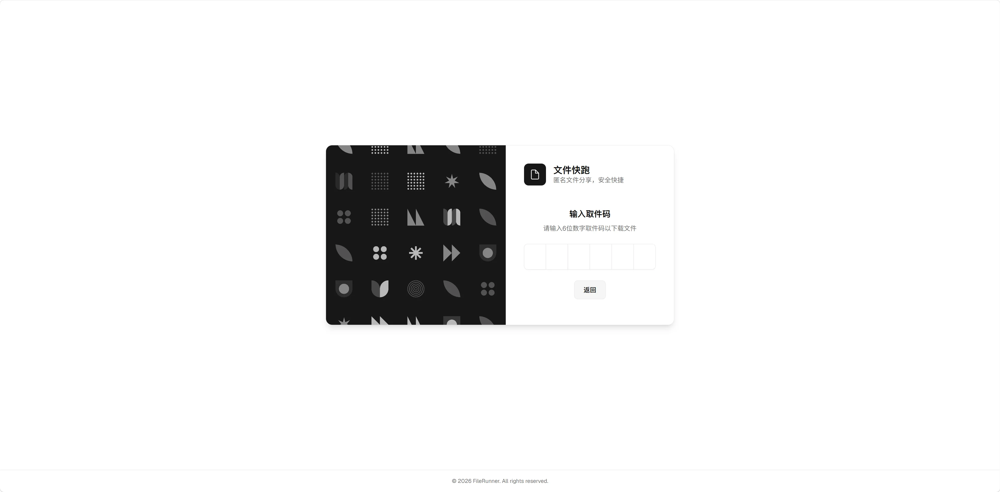
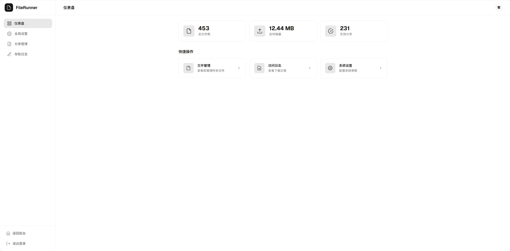
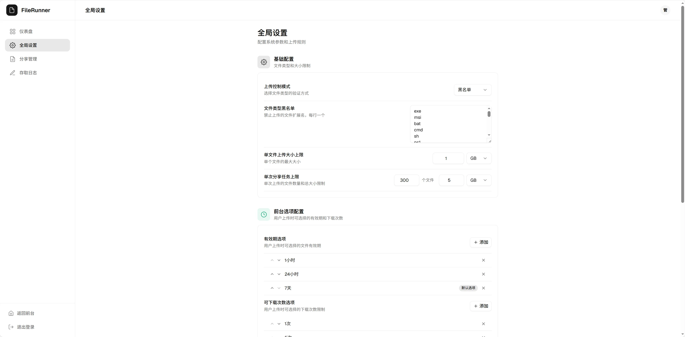

# FileRunner

一个轻量级的匿名文件分享工具，支持单文件、多文件和文件夹上传，通过 6 位数字取件码下载。

## 截图

| 首页 | 取件页 |
|:---:|:---:|
|  |  |

| 后台首页 | 后台设置 |
|:---:|:---:|
|  |  |

## 功能特性

- **匿名上传**：无需注册登录，上传即获得取件码
- **多文件支持**：支持单文件、多文件、文件夹上传，自动识别分享类型
- **灵活的下载限制**：可设置下载次数（含无限次）和有效期
- **管理后台**：完整的后台管理系统，支持文件管理、日志查看、系统配置
- **文件类型控制**：支持白名单/黑名单/无限制三种模式
- **自动清理**：可配置过期文件自动扫描和深度清理策略
- **轮播图管理**：支持首页轮播图和展示任务配置
- **Docker 一键部署**：提供完整的 Docker 配置

## 技术栈

| 层级 | 技术 |
|------|------|
| 后端 | Python 3.11+ / FastAPI / SQLAlchemy / SQLite |
| 前端 | Vue 3 / TypeScript / Vite / Tailwind CSS / shadcn-vue |
| 部署 | Docker / Docker Compose |

## 快速开始

### Docker 部署（推荐）

```bash
# 创建项目目录
mkdir filerunner && cd filerunner

# 下载 docker-compose.yml 和 .env.example
curl -O https://raw.githubusercontent.com/WOLVER10/FileRunner/main/docker-compose.yml
curl -O https://raw.githubusercontent.com/WOLVER10/FileRunner/main/.env.example

# 配置环境变量
cp .env.example .env
# 编辑 .env，设置管理员密码

# 启动（自动拉取镜像）
docker compose up -d

# 访问
# 前台：http://localhost:8000
# 后台：http://localhost:8000/admin/login
```

### 本地开发

```bash
# 后端
cd backend
python -m venv .venv
.venv\Scripts\activate  # Windows
# source .venv/bin/activate  # Linux/Mac
pip install -r requirements.txt
python -m uvicorn app.main:app --reload --port 8000

# 前端
cd frontend
npm install
npm run dev
```

## 环境变量

| 变量 | 说明 | 默认值 |
|------|------|--------|
| `SECRET_KEY` | JWT 签名密钥 | `change-me-to-a-random-string` |
| `ADMIN_USERNAME` | 管理员用户名 | `admin` |
| `ADMIN_PASSWORD` | 管理员密码 | `admin123` |
| `DATABASE_URL` | 数据库连接 | `sqlite:///./data/data.db` |
| `UPLOAD_DIR` | 文件存储目录 | `./uploads` |

## 管理员登录

- 默认用户名：`admin`
- 默认密码：`admin123`（可通过环境变量 `ADMIN_PASSWORD` 修改）
- 登录地址：`/admin/login`


## 项目结构

```
FileRunner/
├── backend/                # 后端代码
│   ├── app/               # FastAPI 应用
│   ├── alembic/           # 数据库迁移
│   ├── requirements.txt   # Python 依赖
│   └── Dockerfile         # 后端 Docker 配置
├── frontend/              # 前端代码
│   ├── src/               # Vue 源码
│   └── package.json       # Node 依赖
├── docker-compose.yml     # Docker 编排
├── .env.example           # 环境变量模板
└── LICENSE                # Apache 2.0 许可证
```


## 许可证

[Apache License 2.0](LICENSE)
